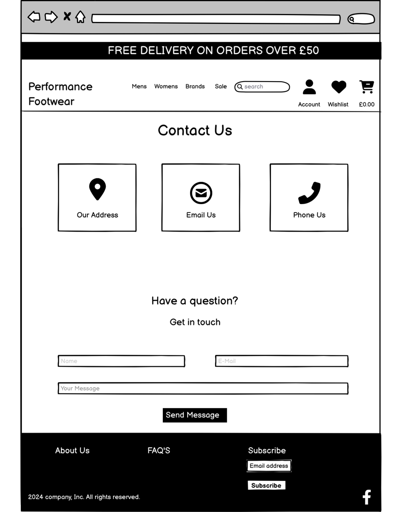

# Performance Footwear

Welcome to Performance Footwear. This website is aimed at users who have a passion for running and the latest running shoes and accessories on the market. 
The site offers exclusive features for users that have an account with us, these include adding items to your wishlist to purchase in the future, viewing your order history, saving delivery preferences and adding reviews to products.
Users who visit the site are met with a user friendly experience, They can easily search for products, view products by category, add products to their bag/basket and make payment easily. There is also a section to send us a message, a privacy policy page and information about returning products.

[Link to Performance Footwear](https://performance-footwear-ed28bb401f1b.herokuapp.com/)

 

# UX

## Strategy

### Target Users

- Running enthusiasts who have an active lifestyle and are interested in quality products.
- Users looking to browse and purchase running shoes and related accessories.
- Users who look for the top brands in the running shoe industry.

### Site Goals

- Allow users to view and purchase products as effortlessly as possible.
- Allow users to swiftly search for the products they like.
- Provide users with the option to create an account to store wishlist items and view orders.
- Allow users to store their preffered delivery address and be able to easily edit this.
- Offer users the ability to contact performance Footwear online.

### Peoject Goals

- Develop a fubctional e-commerce web application.
- Ensure users are met with a user-friendly interface to allow easy navigation around the site.
- Offer users a seamless shopping experience.
- Intergrate exciting features, such as a wishlist and customer reviews, enhancing CRUD functionality.

 

[Back to Top](#table-of-contents)

 

## **Agile Planning**

This project followed an agile planning approach, based on user stories. Each user story was carefully planned and included in a specific iteration.
To prioritize development tasks, each feature was catergorized as Must Have, Should Have, Could Have and Wont Have. Catergorizing each user story helped determine the importance of each feature.

View the project board [here](https://github.com/users/Marchopkins96/projects/7).

 Project Board

## User Stories 

* Based on the user stories created, A project implementation plan was developed.
You can view the user stories [here](https://github.com/Marchopkins96/Performance-Footwear/issues?q=is%3Aissue+is%3Aclosed).

 User Stories

* Using the MoSCoW principle (Must Have, Should Have, Could Have, Won't Have), iterations were planned for the implementation of the user stories.

View milestones [here](https://github.com/Marchopkins96/Performance-Footwear/milestones).

 Milestones

 

[Back to Top](#table-of-contents)

 

## Structure 

### Wireframes

- Wireframes have been created for all pages of the site. wireframes were crafted for mobile and desktop dimensions. [Balsamiq](https://balsamiq.com/) was employed as the tool for creating the site's wireframes.

### Home Page Wireframes

Click to View Home Page wireframes

#### Mobile

#### Desktop

### All Products Page Wireframes

Click to View All Products Page wireframes

#### Mobile

#### Desktop

### Product Detail Page Wireframes

Click to View Product Detail Page wireframes

#### Mobile

#### Desktop

### Basket Page Wireframes

Click to View Basket Page wireframes

#### Mobile

#### Desktop

### Checkout Page Wireframes

Click to View Checkout Page wireframes

#### Mobile

#### Desktop

### Contact Page Wireframes

Click to View Contact Page wireframes

#### Mobile

#### Desktop

### Wishlist Page Wireframes

Click to View Wishlist Page wireframes

#### Mobile

#### Desktop

### Edit Reviews Wireframes

Click to View Edit Reviews wireframes

#### Mobile

#### Desktop

### Database Schema 

- An entity relationship diagram (ERD) was created using [Lucid Chart](https://www.lucidchart.com/pages/tour). This allowed me to visually represent the connections between my data structures and streamlined the development. With this visual aid, it makes it much easier to understand and interact with my data.

[Back to Top](#table-of-contents)

 

## Main Plan 

- Design an inviting homepage that features eye catching images that convey the purpose of the site to the user.
- Implement user account registration to enable restricted access for editing and deleting reviews, adding products to a wishlist and saving personal user information to ensure quick and efficient checkouts.
- Develop a website that is responsive on a multitude of devices, ensuring optimum functionality across all screen sizes.
- Superusers harness the ability to create, view, update, and delete throughout the site.

 

# Features 

## Existing Features

### Home Page 

View home page

- The Home page features a carousel of 3 images to instantly catch the attentions of the users visiting the site.

 

### Marketing Section

View marketing section

- The marketing section is presented neatly in the middle of the homepage with more images relating to the sites purpose.
- Key words are used within the marketing text that link back to the brand name and also to aid search engine optimization.

 

### Footer 

View footer

- The footer is present on all pages of the site.
- It features links to contact, returns, privacy policy and links back to the home page.
- The footer also incorperates links to our MailChimp newsletter signup and a link to our FaceBook marketing page.

View subscription success

 

### Returns Page 

View returns page

- Information of our returns policy is provided for users who desire to return items to us.

 

### Contact Page

View contact page

- Contact information is presented in a clear and consise manner. The business phone number, address and email are displayed seperately at the top of the page.
- The page also includes a contact form enabling users to contact us. The message submitted by the user is stored in the admin panel.

 

### Privacy Policy

View privacy policy

- A privacy policy is a legal document that describes how a website collects, uses, discloses and manages the personal information of its users or customers. It contains information about the types of data collected, the purposes for collecting it, storage and security methods, and the rights of users regarding their personal information.

 

[Back to Top](#table-of-contents)

 

### Main Nav Menu

View information banners

### Free Delivery

### Motivational Message

### Free Returns

- Displayed at the very top of the screen, there is information for the user regarding returns and delivery, as well as a phrase of motivation for visitors to the site.

View main navigation

- Consistent throughout the site, the user will see the main navigation menu. Featuring a search bar, account/profile access, basket link with subtotal if items are in the basket, as well as links to filter products by gender, brand, type of product and sale items. When a user creates an account they will also have access to the wishlist.

 

### Restricted Pages

View logged in Vs logged out views for users

### Logged in view

### Logged out view

- Certain pages on the site are reserved exclusively for users who are logged in. Links to the these pages appear in the Navbar when a user is logged in.
- The wishlist functionality is for users who have a registered account with us.

 

### Product Filtration

View product filtering

- Users can filter products by gender, type of product, by brand and sale items.

View sort by options

- When on the products page users can filter the product by price, rating, name, category and brand.

 

### Search Bar

View different search features

### Search Bar

### Product search result

### No search results

### No search criteria message

- Users can use the search bar to search for specific products (first image above) that they want to view. The search is matched with the product name and description, as long as the search relates to a product it will show results.
- The user is also shown how many results meet their search (second image above).
- If search criteria does not relate to a product it will not return any results (third image above).
- If a user tries to search without inputting any search criteria an error is shown (fourth image above).

 

### Sale Page

View sale page

- This page displays all the sale products, it can also be filtered by gender.

 

### Product Details Page

View product detail page

- The product detail page displays the product image, name, regular price, sale price (if applicable), brand, category, rating, option to add to wishlist, product description, country of origin, materials, option to select size, select quantity and add product to cart.

View Country of origin & Materials Dropdowns

### Country

### Materials

- Country of origin and Materials can be viewed when the dropdown menu is clicked by the user.

View review as a signed out user

- If the user is not signed in they are prompted to do so if they wish to leave a product review.

View review as a signed in user

- If the user is authorized. they can click on "Review this product" and a dropdown menu will appear.

View review drop down

- Once clicked, the window opens and the user is able to write a review and hit the submit button.

View review success message

- When a review is submitted the user will see a success message telling them the review was submitted successfully.

View display of a submitted review

View edit review page

- If a users wishes to do so they can edit their review.

View edit review success message

- When the review is updated a success message is displayed to the user.

View delete review page & message

### Delete review

### Delete review message

- If a user decides they want to delete a review they can simply hit the delete review button.
- A success message is displayed once this action is complete.

View back to top button

- To further add to a positive user experience a back to the top button has been added. It is located in the bottom right of the page and once clicked the user will be returned to the top of the given page.

 

[Back to Top](#table-of-contents)

### Wishlist Page

View wishlist page

- The wishlist offers the users a place to store all the products that they like and may wish to purchase at a later date.
- The wishlist page provides the product image, name, description, regular or sale price and a link back to the product detail page.
- The page also has a delete button next to each individual product as well as "clear wishlist" button at the top of the page which empties everything from the wishlist if pressed.

View empty wishlist

- If a user is yet to add to their wishlist they will be encouraged to go back and browse the products page.

View wishlist icon

- To add a product to your wishlist, you need to click on the love heart icon.

View wishlist success message

- Once a product is successfully added to the wishlist a success message is displayed.

View remove from wishlist message

- If a user clicks on the heart icon again, this will remove the item from the wishlist and a message will display to confirm this.

View view & remove products in the wishlist

- When on the wishlist page, if a user clicks on the binoculars icon this redirects you to the products page.
- You can remove an item from the wishlist by clicking the bin icon.

[Back to Top](#table-of-contents)

 

### My Account Dropdown Menu

View account dropdown as a signed in & signed out user

### Logged out view

### Logged in view

- If a user is not logged in, they will be given the option to either register for an account or log into an existing account.
- If a user is logged in, the My Account drop-down in the navigation menu will contain a link to the user's profile.
- If the user is logged in and has administrator rights, they will have access to "Product Management".

View product management page

- If the user is logged in and has admin permissions, they can add new products to the site from the admin dropdown in the nav menu by selecting "Product Management".
- The add product page contains a form for the admin to fill out with the details of the new product.

View edit existing product page

- If the user is logged in and has admin permissions, they can edit existing site products by clicking the edit icon on either the product card on the all products page or the individual product details page. 
- The edit product page contains the same form as the add product page but the fields are already populated with the product's current data from the database.

View add, edit & delete product messages

### Add product

### Edit product

### Delete product

 

[Back to Top](#table-of-contents)

 

### User sign up page

View user sign up

- Users without an account can register by filling out the sign up form. Once filled out and the sign up button has been pressed the user will then be prompted to verify their email address.

View verify email page & email user recieves

### Verify email page

### Email to user

- When a user has signed up for an account they are instructed to verify their email address.

### User sign in page

View sign in page

- When a user has verified their email they are then met with a sign in page. They can enter their unique username and password to enter the site as a verified user.
- They can tick the remember me button if they wish.

View sign in message

 

[Back to Top](#table-of-contents)

 

### User sign out page

View user Sign out

- If a user is logged into their account and wishes to log out they can do so my simply pressing the sign out button.
- A user will not be instantly logged out and they can cancel the action with the cancel button if they wish.

View log out success message

- When a user logs out of their account they will see a message on screen to confirm this.

### User Profile Page

View user profile page

- When a user has successfully created an account they can then view their profile page. This page contains information about the default delivery address if the usets chooses to save this information. It also features a users order history.

View order history

- Users can click the order number link and when clicked it takes the user the order confirmation page relating to a specific order.

View user details input

- If the users wishes they can fill out the form provided. When they press the 'Update Information' button the information is then saved and the details provided will be used as default.

 

[Back to Top](#table-of-contents)

 

### Shopping bag Page

View shopping bag page

- The shopping bag page can be accessed via the main navigation bar by clicking on the icon in the top right hand corner. The amount spent will tally up as more products are added to the bag.
- The price, quantity and sub total are all dispalyed for the user.

View empty shopping bag

- If a users shopping bag is empty a message will display to say this and a 'Keep Shopping' button prompts users to go back and browse the site.

View item quantity selector

- A user can update their quantity by using the plus and minus buttons. When they are happy with the quantity of items they can press the update button to update the sub total of the bag. A user can add a max of 99 items to the bag.
- A user can delete a product from the bag by pressing the red bin icon.

View grand total

- The bag total is clearly displayed to the user with additional delivery charges if applicable. when these two are added up the grand total is presented to the user. Orders over £50 are free for deliverey anything under this amount delivery is calculated at 10% of the order amount.
- If a user is happy with their bag and wish to continue to purchase they can press the 'Secure Checkout' button, If not they can also press the 'Keep Shopping' button to continue browsing products.

 

[Back to Top](#table-of-contents)

 

### Checkout page

View checkout page

- The checkout page features a form for the users shipping information, this will be prefilled if the user has added a dfault address on the user profile page. The page also features an order summary.

View chewckout details

- If they have not saved information to the user profile page prior to checkout they can do so by checking the 'Save this delivery information to my profile' box.
- Users payments will be processed through Stripe.
- Once a user has added all delivery information and card details the user can press the 'complete order' button or 'adjust bag' if they still need to adjust something.
- One last reminder of the total amount is issued under the buttons.

View checkout order processing

- When the order is completed the user is notified that their order is being processed by a loading spinner covering the screen. once order is complete the user is redircted to the order confirmation page.

View order confirmation

- Once the order is completed, the user is redirected to the order confirmation page informing them that the order has been successful and an email has been sent to the one they provided.
- The page contains all the details provided by the user and what they purchased.
- This page can be accessed again from the user profile page by clicking on the order number of a past order.

View confirmation email

- Once the order is completed the user will receive an email containing a unique order number and a receipt of the total payment amount.

 

[Back to Top](#table-of-contents)

 

### Error pages

View 404 & 500 error page

### 404

### 500

- If a user finds themselves on a page that either doesnt exist or they do not have the rights to be there i.e admin only pages, an error will display on screen with a button directing them back to the products page.

 

[Back to Top](#table-of-contents)

 

### Future features

- In the future i would like to impliment functionality that allows me to see the amount of goods sold per product, and notify customers if a product or size of a product are out of stock.
- Allow users to rate products on the product details page, currently ratings are inputted by admin when adding products to the database. It would give a more accurate reading on ratings if the customers were doing this themselves.

## Design
### Colour Scheme
- White [#ffffff] was chosen as the main background colour as it offers optimum readability and creates a clean canvas for showcasing the products on the website. 
- Black [#000000] was chosen as the colour for the main textual parts of the site and the footer. Readability is maintained throughout and offeres a timeless aesthetic.
- Grey [#f1f1f1] was used for text on the footer, offering a classy look.
- Blue [#007bff] was used to colour some buttons on the site giving a burst of colour and drawing attention to these elements.
- Overall the colour scheme has been kept clean and simplistic, with this being said it still ensures the site looks clean and inviting for users.

### Typography
- Lato font has been used throughout the site, this font was selected as it maintains excellent readability on different devices and offers a more modern and versatile look.

### Site images
- All the images on this site were used as educational material only, images were used from the following sites: [Freepik](https://www.freepik.com/), [Nike](https://www.nike.com/), [New Balance](https://www.newbalance.co.uk/)

 

[Back to Top](#table-of-contents)

 

## **Business Model**

this website operates operates a business to customer model (B2C), giving consumers the ability to purchase goods directly from a consumer. This process is designed to be as quick and easy for the user as possible. 

## **Marketing Strategy**

### **Social Media Marketing**

A facebook marketing page was created in order to promote the website further. This facebook page will feature news about new products, notify users about offers and promotions, as well as place targeted advertising.

View images of Facebook marketing page

### **Newsletter Marketing**

In the footer of the website is a [Mailchimp](https://mailchimp.com/?currency=EUR) newsletter in the footer which is used to send emails to subscribers about the latest products, promotions and discounts.

View MailChimp

[Back to Top](#table-of-contents)

## **Search Engine Optimization (SEO)**

### **Keywords**

Keywords were used in the marketing text on the home page of the site. The name of the company was used in the headings of the marketing text.

View keywords

### **Sitemap.xml**

I created a sitemap using [XML-Sitemaps](https://www.xml-sitemaps.com) for the live site [https://performance-footwear-ed28bb401f1b.herokuapp.com/](https://performance-footwear-ed28bb401f1b.herokuapp.com/)

The XML file is in the root directory of the site.

### **Robots.txt**

The robots.txt file was created using this guide [https://www.conductor.com/academy/robotstxt/](https://www.conductor.com/academy/robotstxt/).

View Robots.txt

[Back to top](#table-of-contents)

 

# Technologies

## Languages Used
* [HTML5](https://en.wikipedia.org/wiki/HTML5)
* [CSS3](https://en.wikipedia.org/wiki/Cascading_Style_Sheets)
* [Javascript](https://en.wikipedia.org/wiki/JavaScript)
* [Python](https://en.wikipedia.org/wiki/Python_(programming_language))

## Frameworks Used

* [Django](https://www.djangoproject.com/)
* [Bootstrap](https://blog.getbootstrap.com/) 

## Libraries And Installed Packages

* [crispy-bootstrap4](https://pypi.org/project/crispy-bootstrap4/) - Template pack used for django-crispy-forms
* [django-crispy-forms](https://pypi.org/project/crispy-bootstrap4/) - Used to render forms throughout the project.
* [dj-database-url](https://pypi.org/project/dj-database-url/) - A package used to utilize DATABASE_URL environment variable.  
* [django-allauth](https://django-allauth.readthedocs.io/en/latest/) - Allows authentication, registration and account management in Django.
* [django-countries, v7.2.1](https://pypi.org/project/django-countries/7.2.1/) - Django application used to provide country choices for use with forms, and a country field for models.
* [gunicorn](https://gunicorn.org/) - A Python WSGI HTTP Server for UNIX.
* [psycopg2](https://pypi.org/project/psycopg2/) - A PostgreSQL database adapter.
* [boto3==1.26.27](https://pypi.org/project/boto3/) - An Amazon Web Services (AWS) software development kit (SDK) used to connect to the S3 bucket
* [Black](https://pypi.org/project/black/) - A Python code formatter.
* [django storages](https://django-storages.readthedocs.io/en/latest/) - Collection of custom storage backends for Django.
* [stripe==7.8.1](https://pypi.org/project/stripe/) - A Python library for Stripe’s API.
* [django-summernote](https://github.com/summernote/django-summernote) - Is a simple WYSIWYG editor.

 

[Back to Top](#table-of-contents)

 

## Tools And Resources
* [GitPod](https://www.gitpod.io/)
* [GitHub](https://github.com/)
* [Heroku](https://heroku.com)
* [Lucid Chart](https://www.lucidchart.com/)
* [Coolors](https://coolors.co/)
* [AmIResponsive](https://ui.dev/amiresponsive)
* [PostgreSQL CI Database](https://dbs.ci-dbs.net/)

 

[Back to Top](#table-of-contents)

 

# Testing

For all testing, please refer to the [TESTING.md](TESTING.md) file.

 

[Back to Top](#table-of-contents)

 

# Bugs

Erros that i encounterd while creating this website and the fixes put in place to resolve issue.

### Exception type: DataError at checkout | Exception value: Value too long for type character varying (2)

- #### Issue

    - When attempting to add a product to the bag with a size selected an error was occuring as the sizes had more than two characters.

- #### Fix

View code change

- Product_size in the OrderLineItem model was modified to a CharField to allow for more characters.

### An empty value could be entered into a products quantity field rendering a ValueError

- #### Issue 
- If the quantity field is left blank and you try to add it to the bag that is when a ValueError occurs.

View Error

- #### Fix 

- The following code was added:

View code added

- This code checks the presense of a value in the quantity box. If the value is missing, an error message is displayed to the user instructing them that a value needs to be specified.

View error message

 

[Back to Top](#table-of-contents)

 