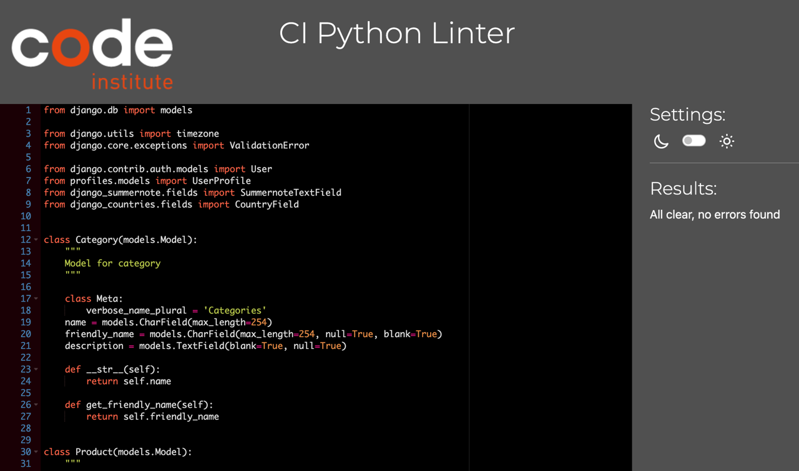
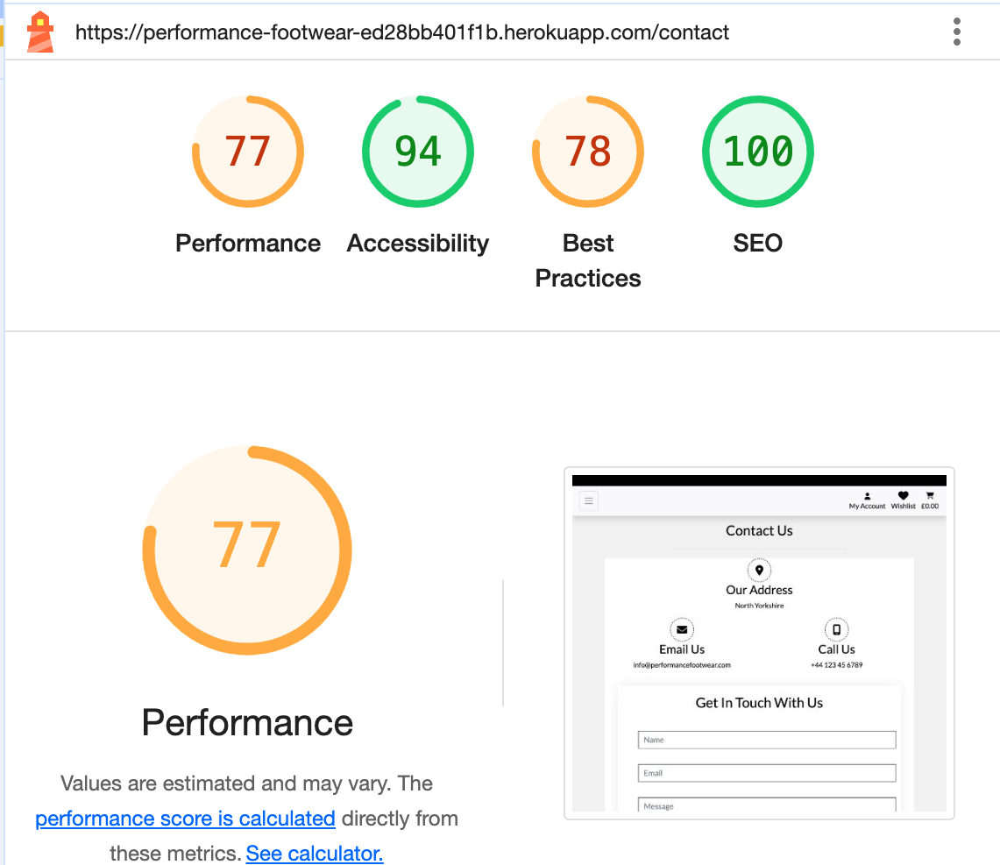

# Testing

Return back to the [README.md](README.md) file.

During the development of this project, various tests were carried out to ensure the website was functioning properly. In this section, you will find documentation on all tests performed on the site.

## Browser Compatability Testing

It is important to test on different browsers to ensure that the site is functional as expected accross them all.

Chrome

Safari

Firefox

 

[Back to Top](#table-of-contents)

 

## Code Validation

### HTML

[HTML W3C Validator](https://validator.w3.org) has been used to validate all HTML files.

Home

All products

Product Detail

Contact

Privacy Policy

Returns

Sign Up

Sign In

Search

Log Out

Shopping Bag

Checkout

Checkout Success

Profile

Add Product

Edit Product

Update Review

Delete Review

Wishlist

 

[Back to Top](#table-of-contents)

 

### CSS

[CSS Jigsaw Validator](https://jigsaw.w3.org/css-validator) has been used to validate all CSS files.

base.css

checkout.css

profile.css

 

[Back to Top](#table-of-contents)

 

### JavaScript

[JShint Validator](https://jshint.com) has been used to validate all JS files.

base.html (postloadjs)

countryfield.js

add_product.html (postloadjs)

edit_product.html (postloadjs)

products.html (postloadjs)

bag.html(postloadjs)

quantity_input_script.html (script)

stripe_element.js

 

[Back to Top](#table-of-contents)

 

### Python 

[CI Python Linter](https://pep8ci.herokuapp.com) has been used to validate all Python files.

Bag contents.py

Bag urls.py

Bag views.py

Performance Footwear urls.py

Performance Footwear views.py

Performance Footwear settings.py

Checkout admin.py

Checkout forms.py

Checkout models.py

Checkout signals.py

Checkout urls.py

Checkout views.py

Checkout webhook_handler.py

Checkout webhooks.py

Home urls.py

Home views.py

Home forms.py

Home models.py

Home admin.py

Products admin.py

Products forms.py

Products models.py

Products urls.py

Products views.py

Products widgets.py

Profiles forms.py

Profiles models.py

Profiles urls.py

Profiles views.py

Wishlist admin.py

Wishlist models.py

Wishlist urls.py

Wishlist views.py

 

[Back to Top](#table-of-contents)

 

## Lighthouse Audit

I have tested the deployed project using Lighthouse in Chrome developer tools to check for any major site perfromance issues.

Home

Proudcts

Product Detail

Contact

HWishlist

Sign Up

Sign In

Search

Log Out

Shopping Bag

Checkout

Checkout Success

Profile

 

[Back to Top](#table-of-contents)

 

## Responsiveness

The deployed project has been tested on different screen sizes to ensure it is responsive.

Mobile (DevTools)

