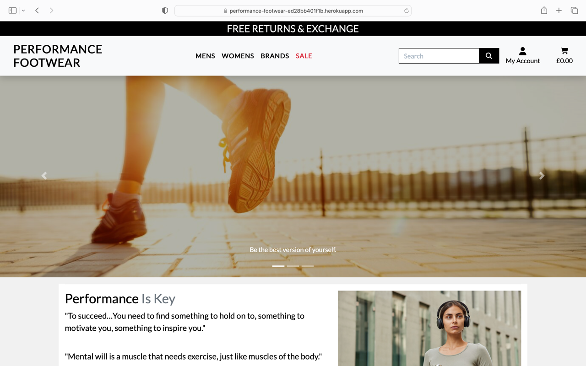
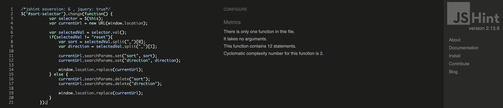

# Testing

Return back to the [README.md](README.md) file.

During the development of this project, various tests were carried out to ensure the website was functioning properly. In this section, you will find documentation on all tests performed on the site.

## Table of Contents

### [Browser Comppatability Testing](#browser-compatability-testing-1)

### [Code Validation](#code-validation-1)
* [HTML](#html)
* [CSS](#css)
* [JavaScript](#javascript)
* [Python](#python)

### [Lighthouse Audit](#lighthouse-audit-1)

### [Responsiveness](#responsiveness-1)

### [Manual Testing](#manual-testing-1)

## Browser Compatability Testing

It is important to test on different browsers to ensure that the site is functional as expected accross them all.

Chrome

Safari

Firefox

 

[Back to Top](#table-of-contents)

 

## Code Validation

### HTML

[HTML W3C Validator](https://validator.w3.org) has been used to validate all HTML files.

Home

All products

Product Detail

Contact

Privacy Policy

Returns

Sign Up

Sign In

Search

Log Out

Shopping Bag

Checkout

Checkout Success

Profile

Add Product

Edit Product

Update Review

Delete Review

Wishlist

 

[Back to Top](#table-of-contents)

 

### CSS

[CSS Jigsaw Validator](https://jigsaw.w3.org/css-validator) has been used to validate all CSS files.

base.css

checkout.css

profile.css

 

[Back to Top](#table-of-contents)

 

### JavaScript

[JShint Validator](https://jshint.com) has been used to validate all JS files.

base.html (postloadjs)

countryfield.js

add_product.html (postloadjs)

edit_product.html (postloadjs)

products.html (postloadjs)

bag.html(postloadjs)

quantity_input_script.html (script)

stripe_element.js

 

[Back to Top](#table-of-contents)

 

### Python 

[CI Python Linter](https://pep8ci.herokuapp.com) has been used to validate all Python files.

Bag contents.py

Bag urls.py

Bag views.py

Performance Footwear urls.py

Performance Footwear views.py

Performance Footwear settings.py

Checkout admin.py

Checkout forms.py

Checkout models.py

Checkout signals.py

Checkout urls.py

Checkout views.py

Checkout webhook_handler.py

Checkout webhooks.py

Home urls.py

Home views.py

Home forms.py

Home models.py

Home admin.py

Products admin.py

Products forms.py

Products models.py

Products urls.py

Products views.py

Products widgets.py

Profiles forms.py

Profiles models.py

Profiles urls.py

Profiles views.py

Wishlist admin.py

Wishlist models.py

Wishlist urls.py

Wishlist views.py

 

[Back to Top](#table-of-contents)

 

## Lighthouse Audit

I have tested the deployed project using Lighthouse in Chrome developer tools to check for any major site perfromance issues.

Home

Proudcts

Product Detail

Contact

HWishlist

Sign Up

Sign In

Search

Log Out

Shopping Bag

Checkout

Checkout Success

Profile

 

[Back to Top](#table-of-contents)

 

## Responsiveness

The deployed project has been tested on different screen sizes to ensure it is responsive.

Mobile (DevTools)

Tablet (DevTools)

Laptop

Desktop

 

[Back to Top](#table-of-contents)

 

## Manual Testing

| Page | User Action | Expected Result | Pass/Fail |
| --- | --- | --- | --- |
| Home Page | Nav Bar |  |  |
|           | Click on Company Name | Redirct to home page | PASS |
|           | Click on Register | Redirct to sign up page | PASS |
|           | Click on Company Name | Redirct to home page | PASS |
|           | Hover over Mens | Dropdown menu appears | PASS |
|           | Hover over Womens | Dropdown menu appears | PASS |
|           | Hover over Brands | Dropdown menu appears | PASS |
|           | Hover over Sale | Dropdown menu appears | PASS |
|           | From Mens dropdown select 'trainers' | redirect to mens trainers | PASS |
|           | From Mens dropdown select 'socks' | redirect to mens socks | PASS |
|           | From Mens dropdown select 'water bottles' | redirect to mens water bottles | PASS |
|           | From Mens dropdown select 'all accessories' | redirect to all socks and water bottles | PASS |
|           | From Womens dropdown select 'trainers' | redirect to Womens trainers | PASS |
|           | From Womens dropdown select 'socks' | redirect to Womens socks | PASS |
|           | From Womens dropdown select 'water bottles' | redirect to Womens water bottles | PASS |
|           | From Womens dropdown select 'all accessories' | redirect to Womens socks and water bottles | PASS |
|           | From brands dropdown select mens or womens Nike or New Balance | redirect to Brand and Gender selected | PASS |
|           | From Sale dropdown select mens or womens sale items | redirect to gender sale items selected | PASS |
|           | From Sale dropdown select 'all sale items' | redirect to all sale items | PASS |
|           | Enter word into search bar that appears in at least one product's name or description | Redirected to products with relating to searched word | PASS |
|           | Enter word into search bar that doesn't appear in any product's name or description | Redirected to empty product page as no products match search criteria | PASS |
|           | Enter nothing into search bar  | Redirected to products page, message displays to state no search criteria was met | PASS |
|           | If authenticated, Click 'my account' | sub menu display | PASS |
|           | From 'my account' menu select product management | redirect to product management page | PASS |
|           | From 'my account' menu select my profile | redirect to profile page | PASS |
|           | From 'my account' menu select logout | redirect to logout page | PASS |
|           | If authenticated, click on wishlist icon | redirect to wishlist | PASS |
|           | Click on shopping bag icon | redirect to shopping bag page | PASS |
| Home Page | Footer | | |
|           | From footer select 'home' | redirect to home page | PASS |
|           | From footer select 'contact' | redirect to contact page | PASS |
|           | From footer select 'privacy policy' | redirect to privacy policy page | PASS |
|           | From footer select 'returns' | redirect to returns page | PASS |
|           | From footer enter email into subscribe text area | be subscribed to newsletter, success messgae display | PASS |
|           | From footer click facebook icon | redirect to facebook marekting | PASS |
| All Products Page | |  |  |
|             | From the products page, click a product you wish to view | redirect to product detail page | PASS |
|             | Use sort by dropdown menu to sort by certain criteria | once criteria select, products sort as requested | PASS |
|             | If authenticated, click wishlist icon on product image to add to wishlist | Product will be added and message displays | PASS |
|             | If admin user, select edit/delete icons | redirect to edit product page/product deleted message displays | PASS |
| Product details page | | | |
| | Click on Product image or name in Products page | Redirects to Product Detail page | Pass |
| | Click on Keep Shopping button | Redirects back to Products page | Pass |
| | Click + button on quantity selector form | The quantity increases by + 1 up to maximum 99 per product | Pass |
| | Click - button on quantity selector form | Quantity number decreases if current quantity is greater than one | Pass |
| | Manually enter number greater than 99 in quantity selector form | The quantity is automatically changed to the maximum allowed quantity of 99 | Pass |
| | Manually enter a negative number | An error message appears that the number must be greater than or equal to 1 | Pass |
| | Enter quantity as blank | An error message appears that you must specify quantity | Pass |
| | Click Add To Bag button | Product is added to bag and quantity is set to the user's choice | Pass |
| | Click Add To Bag button when user already has the product in their basket | Quantity selected is added to the existing quantity in the user's bag for the product | Pass |
| Reviews Page | | | |
| | Click on "Review This Product" button | Additional fields “Title” and “Review” will open below for writing a review | Pass |
| | Click on Submit Review button with missing fields | The user will see a message indicating that the review was not sent | Pass |
| | Click on Submit Review button with all valid fields | The user will see a message indicating that a review has been added | Pass |
| | Click on Update Review button | Redirect to Edit Review page| Pass |
| | Click on Update button | Redirect to product detail page with already edited review | Pass |
| | Click on Delete Review button | Redirect to Delete Review page | Pass |
| | Click on Delete Review button on Delete Review page | Review will be deleted and the user will be redirected to detail page | Pass |
| WishList Page | | | |
| | Сlick on the binoculars icon | Redirect to product detail page of specific product | Pass |
| | Click on the trash can icon | The item will be removed from the Wishlist page and the user will see a success message | Pass |
| | Click on CLEAR WISHLIST link | All products are removed from the Wishlist | Pass |
| | When wishlist is empty, Click on Go To Product button |  Redirect to Products page | Pass |
| Sign Up Page | | | |
| | Click on Register button under account on nav menu | Redirect to Sign Up page | Pass |
| | Enter valid email address | Field will only accept email address format | Pass |
| | Enter valid password (twice) | Field will only accept password format | Pass |
| | Click Sign Up button on sign up page | Sends confirmation email and lets user know to check their email | Pass |
| | Click link in confirmation email | Redirect to sign in page | Pass |
| Sign In Page | | | |
| | Click on the Login button in the account dropdown in nav menu | Redirect to Login page | Pass |
| | Enter valid email address | Field will only accept email address format | Pass |
| | Enter valid password | Field will only accept password format | Pass |
| | Click Login button on login page | Redirects user to homepage | Pass |
| | Sign in before confirming account | Redirects to message reminding user to confirm email address | Pass |
| Log Out Page | | | |
| | Click Logout button | Redirects user to logout page | Pass |
| | Click Confirm Logout button | Redirects user to home page | Pass |
| User Profile Page | | | |
| | Click on the My Profile link under account on nav menu | Redirect to User profile page page | Pass |
| | Click Update Information button | Saves form contents to be default information for user | Pass |
| | Click Order Number for previous order in Order History | Redirects user to order confirmation page for that order | Pass |
| | entering the URL to the profile if not logged in | User given an error | Pass |
| Shopping Bag | | | |
| | Click Bag icon in main nav | Redirects user to bag page | Pass |
| | Click + button on quantity selector form | The quantity increases if the number + 1 to 99 | Pass |
| | Click - button on quantity selector form | Quantity number decreases if current quantity is greater than one | Pass |
| | Manually enter number greater than 99 in quantity selector form | The quantity is automatically changed to the maximum allowed quantity of 99 | Pass |
| | Manually enter a negative number | This item is automatically removed from the bag after clicking the Update icon because the value entered is incorrect | Pass |
| | Click icon update  under quantity selector form | Updated quantity of product in bag to number in quantity select form | Pass |
| | Click icon remove button under quantity selector form | Removes product from basket completely | Pass |
| | Remove item from bag that brings total to below £50 | Delivery goes from FREE to 10% of the total cost of the bag contents | Pass |
| | Click on Keep Shopping button | Redirect to Products page | Pass |
| | Click on Secure Checkout button | Redirect to checkout page | Pass |
| Checkout | | | |
| | Click on Secure Checkout button in basket | Redirection to checkout page | Pass |
| | Click Complete Order button without all required fields filled out | Message letting user know that required fields need to be filled out | Pass |
| | If logged in, Click Save delivery information to profile button | User's default information will be set to whatever is filled in at the checkout on order completion | Pass |
| | If not logged in, Click on Create an account link | Redirection to sign up page | Pass |
| | if not logged in, Click on login link | Redirection to sign in page | Pass |
| | Click Complete Order button without card details filled out | Message letting user know that their card number is incomplete | Pass |
| | Click Complete Order button with all details filled out | Loading spinner appears and order is processed | Pass |
| | Order completed | Order confirmation email is sent to the user and redircted to checkout success page | Pass |
| Checkout Success Page | | | |
| | Order completed | Redirect to checkout success page | Pass |
| | Click view sale items button | Redirects user to sale items | Pass |
| | If viewing from profile order history, Click Back to profile button | Redirects user to their profile | Pass |
| Add Product Page | | | |
| | If admin user, Click Product Management link from My Account dropdown | Redirects admin to add product page | Pass |
| | Click Cancel button | Redirects admin to Products page | Pass |
| | Click Add Product button with form filled correctly | Creates a new product on the site using the information provided | Pass |
| | Click Add Product button with form filled incorrectly | Message appears letting the admin know to fill in the required form fields | Pass |
| | Click Add Product button with no image set | Product will be created but will be displayed with default product image | Pass |
| Edit Product Page | | | |
| | If admin, Click edit icon on product | Redirects user to Edit Product page | Pass |
| | Click Cancel button | Redirects admin to all products page | Pass |
| | Click Update Product button with form filled correctly | Updates product with information provided | Pass |
| | Click Update Product button with form filled incorrectly | Message appears letting the admin know to fill in the required form fields | Pass |
| | Click Update Product button with no image set | Product will be updated but will be displayed with default product image | Pass |
| Delete Product Page | | | |
| | If admin, Click delete icon on product | Redirects user to Edit Product page | Pass |
| | Click Cancel button | Redirects admin to product detail page for selected product | Pass |
| | Click Delete Product button | Product will be completely deleted from the site | Pass |
| Contact Page | | | |
| | Click on Contact Us link in footer | Redirect to contact page | Pass |
| | Enter name | Form will only submit if all fields are filled | Pass |
| | Enter valid email address | Field will only accept email address format | Pass |
| | Enter message | Form will only submit if all fields are filled | Pass |
| | Click Send with missing fields | Message lets user know all fields are required | Pass |
| | Click Send with all valid fields | The user will see a success message in the upper right corner and administrators in the admin panel will see this message | Pass |
| Admin Panel | | | |
| | Add product | admin can add products | Pass |
| | Edit product | admin can edit products | Pass |
| | Delete product | admin can delete products | Pass |
| | Add brand | admin can add brands | Pass |
| | Add categories | admin can add categories | Pass |
| | Add product variants | admin can add product variants | Pass |
| | Add reviews | admin can add reviews | Pass |
| | CRUD reviews | admin can read, add, edit and delete reviews | Pass |
| | CRUD contact form submissions | admin can read, add and delete a contact form submission | Pass |
| | Manage orders | admin can manage orders | Pass |